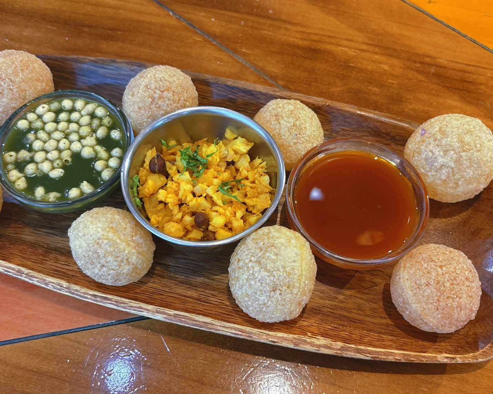
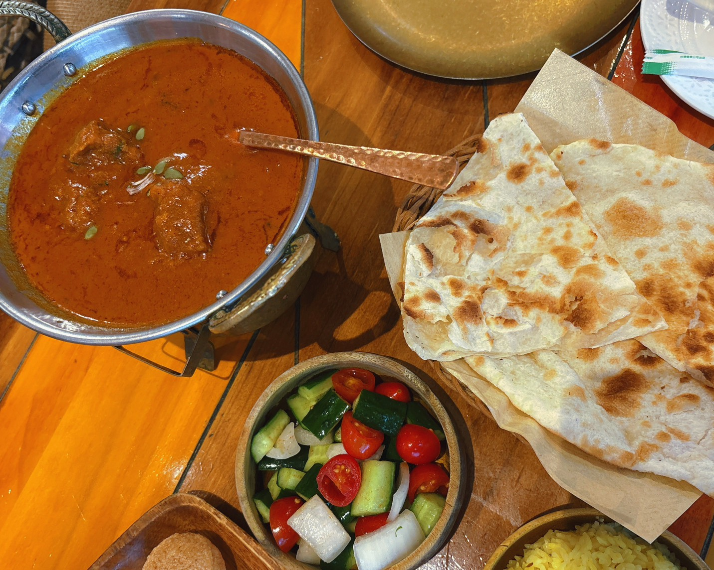
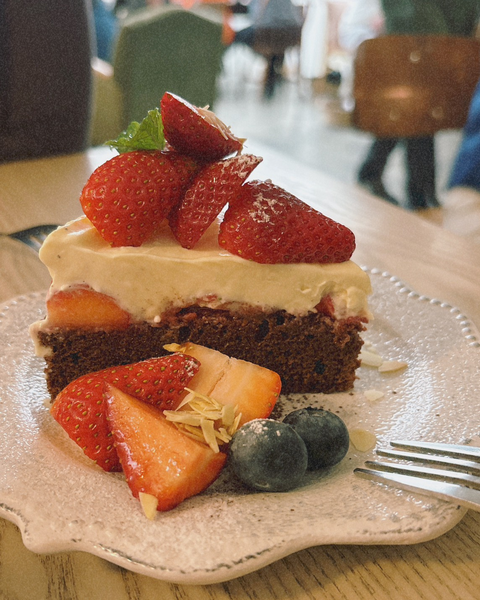

昨天與朋友吃飯，在外面操作正午冥想，相當溫柔又舒服。

尤其在呼喚自己的時候，內心環繞的聲音溫柔得幾乎是冷壓初榨純淨橄欖油等級。

「我的小公主，不怕，我陪妳。」

「害怕也沒關係，只要妳需要，我都在。」

「可以在放鬆些，我親愛的、摯愛的心肝，深呼吸，吐氣。」

接下來，更是對身體的部分進行無尷尬癌成分的彩虹稱讚。我的身體非常的……受用，令我不知道該讚嘆，還是該抱頭替自己尷尬一下？

沒有報名的朋友在旁邊等我操作的時候，不僅肚子咕嚕嚕的，跑去廁所，結束後分享說：「妳在操作那個動作的時候，我整個從頭皮麻到腳底！」

某方面來說，從高度敏感的朋友口裡聽到這些，真的挺新鮮的。

沒想到，回家後我操作晚間冥想時，從頭到尾雞皮疙瘩到不能。

我感覺我和我的身體，已經是被呵護到癱軟在某個溫暖懷抱裡，被剪指甲啊、擦護甲油──連腳趾甲都不放過的那種地步了！

簡直通體舒暢，暖和得像是泡完溫泉。

更不用說，換成畫圖時，我依然感受到被掌上明珠般的疼愛氛圍包覆。

啊，這下子答案很清楚了，這大概是我跟我朋友聚餐的時候，兩方靈魂可能交流了什麼？

朋友對此也深有同感，立即回饋自己看見自家哥哥的樣子，還截了一張精準的示意圖給我看。

嗯，什麼軍裝 × 皮鞭 × 抬下巴的組合。

雖不想承認，但我也難以否定我哥可能真的會出現這種風格，但朋友表示喜歡。

嗯，好，祂們……真的……交流了什麼吧，尤其朋友家的靈魂簡直是妹控界翹楚。

那我哥算是玩抖 Ｓ 玩到淋漓盡致嗎？

答案不言而喻。

不過，這讓我想起[小湛的前幾天的文章](https://skylikesun.blogspot.com/2026/01/blog-post_15.html)， 0 、 1 和 1+1 （？）。

說來奇妙，我還沒看完時就還滿明白兩方的狀態，莫名覺得我哥以前……應該兩個都玩（？）過。

幸好我的臉皮在去年風暴完後，已經長厚了，沒有感到特別尷尬。

希望這不是立 flag ！

   

   