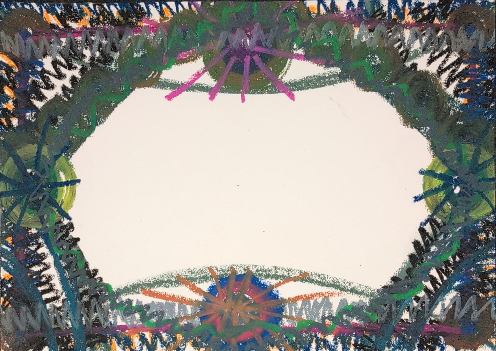

看完小湛的皮包見解後，我忍不住笑出來。

我曾經也有一顆200元的短夾，撐了十多年都不換。在我大學時，就連我媽要花錢幫我買，我都拒絕了。

即使我非常想換，但我的意志力和算盤卻用在這裡：「家裡不是經濟負擔大嗎？這個也沒有壞，並非是必要性支出吧？把買真皮夾的三千元拿去買菜買衛生紙繳水電，還有阿公阿嬤的醫藥費，不是很好嗎？妳上禮拜不是才跟我靠妖沒有錢了？這下子又因為別人要衝業績妳就要幫她買？」

一連串問號，逼得當時我媽也不開心，嚷著又不是花妳的錢後，不了了之。

可是，最後卻都得由我承擔──或者，我自願地承擔著，只為了扮演好那個為家庭著想的乖小孩。

其實，這一回想起來，過去的我還滿多委屈和忍耐的，連帶那顆錢包應該也是充滿的自我詛咒。

應該不會像是什麼煞氣＠卍特級咒物卍啦。

今天，確認現役錢包，大概是2023年7月的時候買的，這樣也差不多要替換了。

當初會換，也是因為終於受不了了，為什麼林北要委屈自己，我就不能用好一點嗎！

替換後，願意把錢花在自己身上的頻率增加了。

畫圖過程，難得擺橫的來畫圖，聽到聲音說算是整理得OK，只是還滿多社會、家族業力的影響（執念）在上面。

可能本身就練有客家等級 10 的被動技能，buff一開，確認好幾次好像要買短夾。

也好，很好收納。

豈知，晚冥時，團隊忽然大聲公：「買～長～～～夾～～～」

身體也跟唱：「我要長的～～～～～～」

我：「蛤？」

「長～～～～～～～夾～～～～～～～～～」

好好好，聽到了啦！(っ °Д °;)っ

   