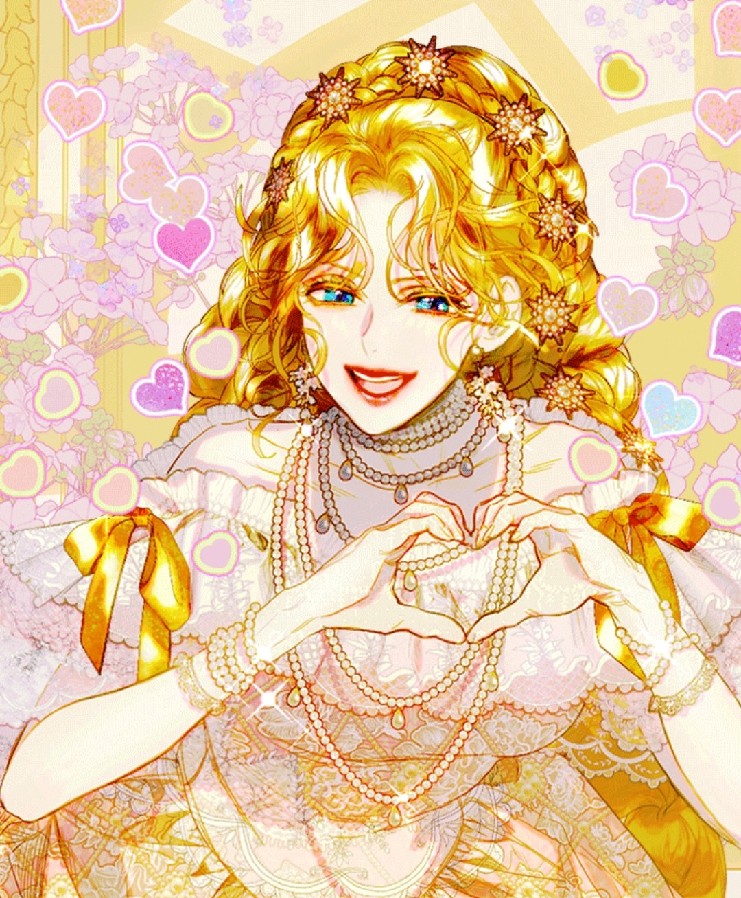

前天晚間冥想加強資源實名制，避免靈魂太大愛分送給別人。

我很在意這件事情。

就算我哥說沒有，我始終抱持懷疑的態度，哪怕有時候畫圖忍不住問問長輩。

祂們大多都會先詫異地挑眉，然後問：「妳這樣想的原因是什麼？」

「因為我不相信祂。」我想了想，誠實說道：「或許是這一部分的我，不相信我可以保護自己。」

誰知道我這個人存在的角色面具或偶包設定，造成資訊偏差的訊息，不是嗎？

難保我的思維跟行為不對齊的傲嬌，造成界線模糊，自己也糊里糊塗把資源送過去了？

只是，我不再把神經質般到質疑晉升到瘋狂自虐模式。

我不想勉強自己相信，先短暫在這個狀態，允許自己神經質般的觀察。

豈想，晚冥沒多久，就想爬床躺著，伴隨小湛的聲音到不知不覺睡著了。

夢裡，我住在奢華歐洲宮殿，成千侍從。

上有超級金光閃閃的女皇媽媽，大捲金髮、衣裝華貴，自信迷人，始終坐在象徵王權的寶座上，撐顎聽著政務報告。

下有一個小公主妹妹，目前不在王宮，她在皇宮外的民間市集，積極慈善，忙得不見小蹤影。

這時接獲陳情，是與妹妹合作慈善的水果攤老闆，苦不堪言。

女皇乾脆地指派我全權處理。

我沒有要喬裝的意思，直接帶著一隊侍衛找妹妹，接著在一個大市集找到像隻亮麗小蝴蝶穿梭的四歲妹妹。

妹妹甩著一頭馬尾金髮，同樣金光閃閃的洋裝，親和力十足，拖著紙箱協助接濟難民，並安置在市集最大的水果攤。

水果攤老闆看見我來了，看見救兵似的，趕快跟我抱怨很多。

一開始還好，但隨著難民待久了，很多客人投訴、迴避，久之已經影響到他的生計了。

以整體和諧性來說，難民衣衫襤褸、裹著紙箱保暖塞在攤販角落，觀感上不和諧。

神智不清待著。

雖然這是他們的狀態，但顯然已經超出老闆的負荷了，意味著合作關係岌岌可危。

眼看小公主妹妹又要繼續接濟第三個，找第四個，我直接喊住她，跟她提出老闆的困擾。

妹妹很不理解，睜著眼睛問我：「可是這已經說好了啊？」

我認真道：「當時說好，不代表一直都是好。隨著日子累積、人數增加，超出老闆負荷了。」

「那、那是要趕他們走嗎？他們很可憐！」

「他們很可憐沒錯，但比可憐又如何？老闆一家老小不可憐嗎？這件事情已經帶給他們影響了。」我說。

「妳繼續帶人進來，妳有想過他們短暫得到溫飽，然後呢？下一步是什麼？」

妹妹愣了，顯然沒有想過。

「好，妳解他們一時之困，這狀態要維持多久？出現疾病、負外部邊際效用時，妳拿什麼承擔這些成本？」

「接下來，妳能負責多久？老闆那邊已經出現疑慮了，妳要拿甚麼跟老闆協商？先不談如何提升老闆的生意，妳現在要如何確保合作對象繼續跟妳合作，願意跟妳一起扶持難民？」

「比如難民是否願意以勞力換取食宿？老闆是否要願意？如果不願意的原因是甚麼？確認差異後，妳能補洞嗎？用什麼補？妳清點過妳現在的資源有哪些嗎？如果沒有該怎麼獲得？得不到我是不是要放棄？放棄後的風險和收拾又要怎麼計算，妳有問過自己嗎？」

妹妹一臉驚慌，「我只是想幫忙……」

「想幫忙沒問題，妳需要思考的是現在發生這件事情，妳該怎麼辦？」

也許是我太認真，妹妹扁嘴，委屈生氣地哭喊：「我又不是你！你是媽媽親生的皇子！我哪裡知道這麼多！我就是被抱養的外人──」

我一臉冷漠，只想著「喔，又來了」，隨著妹妹大哭，我蹲下來握住妹妹的雙肩，等到妹妹哭到一段落，徐徐開口：

「如果妳只被當作外人，母親是不會在妳身上投入這麼多資源，還給妳支助的資金。」

「妳要記得，不是每個人都跟家裡一樣，那些人也不是妳。」

「接下來，妳想要怎麼做？」

她哭哭啼啼去問水果攤老闆了。

這時，我才發現，我他媽的才七歲。

完美結束後，一身金光閃閃、華麗的金髮媽媽聽了，隨口跟侍從說：「那就挪一下三千萬，當作賑災資金吧。」

她頭頂一小根黃金簪，就足夠尋常四口吃穿用度一輩子了。

我聽了不置可否，只說：「要有資格吧。」

媽媽彎唇一笑，「你決定就好，我信你。」

醒來，我後知後覺覺得很詭異。

我他媽的也太認真了吧？

夢裡的我是小皇子，七歲，妹妹更小是四歲還三歲。

雖然裡面提到金礦資源，我聯想到小湛的晚宴冥想，保存資源。

那麼，以榮格心理學的解夢角度，把我的角色當作自我，也是往界線、規則、可持續性的方向發展。

妹妹的角色原型是害怕被否定、渴望被愛，用付出來證明自己可以有價值的內在小孩。即使她是被愛著，仍會因為自卑對「愛」產生質疑。

媽媽則是像是偉特塔羅的女王，提供豐盛的資源與權威，一句話就可以調動資源。同時，這可能也在詢問我：

我是否也用資源，來換取社會認同的價值觀？

還滿有趣的。

雖然有幾次夢到自己在問別人的時候，也是認真到對方開始慌張、害怕、哭唧唧的。

但我根本沒有情緒起伏，就是上班那種認真，認真確認你想這麼做的原因是什麼？你真正需要的是甚麼？然後一路問下去。

嗯，不置可否，看到我這麼認真盤問，我覺得我家資源應該是有好好保護著吧。

在夢裡，我好像不止一次嚇哭別人了……

（難道是家業附體？）

<figure style="margin: 0.8rem auto; text-align:center;">
  
  <figcaption style="font-size: 0.95em; opacity: 0.8; margin-top: 0.4rem;">
    夢裡的媽媽是類似這樣金光璀璨喔（取自《契約皇后的女兒》）
  </figcaption>
</figure>

