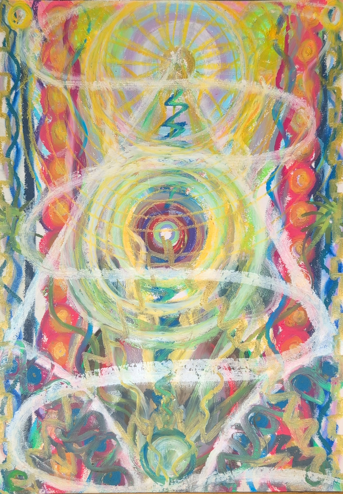

我做了一場夢。

夢裡，我剛下班回家，就見家裡變成補習班。有兩個已經沒聯絡的朋友都在我家打工，還自動加班幫我媽打下手。

見狀，我不禁感到慶幸自己不用加班，逕自去陽台曬衣服。

豈知，正要取下曬乾的帽T，竟直接從衣架掉落。

我下意識要撿起時，稍頓，不動聲色地重新掛好帽T。

離開陽台後，我驟然扭身，探手一拽！

憑空硬生拽出一隻嬰兒！

「哦。」我呵呵兩聲，五指如爪掐著祂的大餅臉，「誰？」

這個嬰兒頭大身小，胖到掐不到脖子，但雙頰圓鼓鼓、粉粉腮紅，本該討喜的大餅臉滿是慌張，掙扎不出我手裡。

「我認識你，你是──」嬰兒馬上精準說出我的本名，「是你爸爸媽媽找我幫忙的！」

老套。我偏首，「哦，那我爸媽的名字、生日、手機多少？同伴都會有暗語核對身份，說吧。」

嬰兒支支吾吾，「我、我不能說！」

「啊，是被威脅不能說嗎？是我的不對。」見嬰兒神色微鬆，我扯起一邊的唇角。

猙獰的。

「我應該要問你──我的靈魂叫什麼？」

祂神情瞬間龜裂，我享受般地追問：「那，我的源頭家人名字呢？你 Call 得到祂們吧？隨便叫一個出來。我們就不需要玩躲貓貓了，如果你是來輔助我的，這不是挺簡單的嗎？」

「我我我──」嬰兒滿頭大汗，竟慌得屁滾尿流噴出兩顆電池！

兩顆三號電池。

我眨眨眼，旋即黑臉。

這傢伙撒丫子想跑？休想！

視線一抬，嬰兒彷彿被種在原地，被塞進一件深藍色大斗篷，連眼睛都露不出來。

即使我一手箝制住祂，可有股阻力令我不能攻擊祂。

我無比憾恨，收回嘗試戳瞎祂眼睛的手。

「我可不是說謊，這兩顆電池是跟你有關係喔！」眼見我無法攻擊祂，祂抖著聲音有幾分得意，其中一顆電池浮空在我們之間。「而且，我這還能維持 60% ！。」

聽祂嘮叨一堆祂吸收的電池多棒多好，我垂眼端詳。

電池看起來還算乾淨，但氛圍是可見的陳舊，也有編碼註記。在我看來，這算是好幾個世代以前的玩意，現在市面上流通的電池也不是這一款型號。

但為什麼與我有關？

我就醒了。

起初，我沒當一回事。

這陣子忙著功課，又彈跳出「我必須照顧他人」的念頭，轉頭又撞上靈魂議題的海嘯。我每天睡醒沒多久，就會被畫面、訊息驚爆到像隻迷惘惶恐的柯基。

這個奇妙的嬰兒夢，我權當作是舒壓。

直到跟朋友討論到最近煩惱的事情，我才想起這個夢。

此時，朋友說了一句：「那個嬰兒好像是外星人？有股臭味！祢要不要找長老畫看看？」

我目瞪口呆，頓時回想起，這陣子畫圖、冥想或安靜下來時，大腦會有不斷掉幀數般的跳躍現象。

除了照顧他人的念頭外，也有幾個是夢裡這個嬰兒、前陣子同學分享的植物入片段。

一開始，我只覺得我還不習慣跟自己相處，努力拉回注意力，告訴自己不需要可憐別人，這只是我的代償罷了，卻從未想到還有這個方向！

畫圖時，長老幫忙一瞧，「有很大部分的自我詛咒。」

彷彿抓到一線生機，我忍不住問：「這兩個壓力是有關聯的嗎？」

「嗯，有的。」

「長老的意思是，我哥放任著這個外星植入物，就像是增幅器一樣，擴大『我必須照顧別人的需求』振幅，鞏固我需要對大家負責的信念？」

「妳的靈魂本身厭惡自我，同時希望提供幫助、照顧別人來降低自我存在的罪惡感。只要情況沒有按照祂的預想發展，失去控制觸發創傷又自厭，毫不留情懲罰自己，極端強迫自己去照顧他人──這是自我詛咒的一種。」

「厭惡自己不值得存活，但妳又得在這個世界活下去，那麼照顧他人就像是一種無意識的生存目標。只要妳厭惡自己，就會需要從祂人身上取得補償，來感受到自我價值的需求。」

「滿足需求，妳自然會繼續去做；沒有，妳就會更討厭這樣，加強這個動力去滿足需求。」

這是自體發電機嗎！

以當自我厭惡成為動力，為自己充電強迫自我照顧他人？

但這跟又跟植入物有什麼關係？

「夢裡，妳看到的那個嬰兒本體就是植入物。」一旁的小蘗驟然出聲：「我看資料是說，對方本來想要偷偷來，直接被哥當場抓包。」

祂說著，我同步到那時候的景象。

我哥一身亞麻色系西裝，優雅般的貴公子一手插在口袋，一手抓著對方的腦袋提離地面，請教對方有何貴幹。

我一時間，啞口無言。

到底是我的腦袋充滿暴力嗎？愛與和平像是鴿子飛出我的大腦資料庫了嗎？

「喔，我的阿寶，妳還不知道後面。」小蘗說著，不禁咧出陰沉的獰笑。

「我們那位哥哥呢，祂瞧著這個增幅器做得還不錯，就扯著物權歸屬，唬得對方自願放棄智慧財產權，後來就改成妳看到的，用自我憎恨加強照顧他人的自體發電循環。」

不，這是可行的嗎？算了，我到底該說什麼？我之前居然把這東西養得這麼滋潤？還好都拔掉了？稱讚我哥真是會物盡其用？有文化的流氓真可怕？

嗯，果然，不怕外面有神經病，就怕家裡有自虐成癮的神經病。

<figure style="margin: 0.8rem auto; text-align:center;">
  
  <figcaption style="font-size: 0.95em; opacity: 0.8; margin-top: 0.4rem;">
    日常整理
  </figcaption>
</figure>
