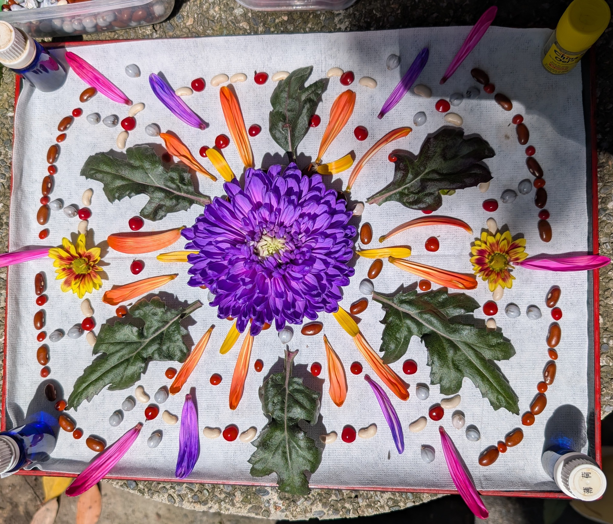

×自我（Self）的世界

早餐後， Sasa 教練領著我來到後院。圓柱石桌上擺放著許多天然素材，諸如花朵、種子，以用來創造屬於自己的曼陀羅（Mandala）。

「不需要擔心好不好看，一切讓內在自我流動就好。」Sasa教練說著。

這與小湛的繪圖課有異曲同工之妙，不需要加以控制的部分，讓身體的智慧去帶著自己創作。

我默默坐上凳子，目光瞄準一朵生得極好的紫菊花，手卻僵硬在半空，遲遲難以下手。

「拔吧。」小蘗魔鬼般的聲音溜進來。

「神經病啊。」我不住齜牙咧嘴，「直接掐斷耶？」

「祂們通透著。」小蘗面無表情地說：「比起妳的大腦限制，祂們更懂得接納當下。」

我「喔」了聲，「大腦真的很愛定義吧。」

「是妳安全感不足。」對我的自嘲，小蘗僅是瞥我一眼，「因為不安全，需要更多『確認』、更多的『控制』，妳才會感到安心。」

「當妳害怕做錯、害怕傷害，為了預防和控制，就會出現妳擔心的『過度腦補』。」小蘗冷聲得像是在念教科書，「這是生存機制，並沒對錯之分。」

「只是妳會習慣性聚焦痛苦、錯誤。越是如此，妳越放大恐懼，不自覺走入牢籠內，舉步維艱，連探索都不敢。」

祂舒出一口氣，彷彿再看一個小傻子。

「其實，妳可以直接問祂們。」

我抿抿唇，索性深呼吸幾回後，伸手摸向紫菊花。當即，一股莫名其妙的「當然好呀」流過腦海。

是嗎。

「有誰能不犯錯？」老掉牙的說法，我每天都跟自己說，但我依然感到害怕。或許，說是害怕傷害別人、令別人失望，不如說──

我無法接受自己不完美。

明明已經瞭解不可能有「完美」存在，我也明白「不完美正是獨特」，我還是自己走進籠子裡，自我折磨。

「那妳肯定很受傷吧！」

腦海又莫名飄過一句與「當然好呀」類似的音調。我的目光不由停留在如火烈焰的紫菊。

「犯錯也可以很美麗啊！」

「這是被地球母親和宇宙包容的呀！」

「如果有人不允許妳犯錯，那肯定對方也受傷到不敢自己承擔吧！」

「喔不，也可能是覺得自己很不美麗，又無能接受這樣的自己才責怪妳，讓自己好受些吧！」

聽著，我的目光也逐漸死魚般地往上翻，眺望上空。

原來，我難以接受不完美，是因為曾經的我遍體鱗傷，不如把自己關在牢籠裡，這樣我就不會受傷了。

只要一切可控，就不會再受傷。

只要我確保所有言行舉止都經過籠子，就不會再受傷了。

但現在，這個籠子令我感到窒息。

為什麼？也許長大了吧。

「謝謝。」我說，然後兩指用力地朝花莖一掐！

「呃？」我傻眼。

紫菊仍挺起胸膛，無比堅挺。

靠夭，我折不斷？！

我的大腦高速運作，想到好幾個替代方案。旁邊的盒子裡的一朵橘紅色菊花，大小不亞於紫菊。

「略小，不適合我們。」鮮少開金口的哥哥倏忽開口。

我還沒發作，小蘗便涼涼地開口，如魔鬼在我耳邊吹風：「哪裡自找苦吃？在創作的世界何必委屈自己『將就』呢。」

祢兩混蛋給我閉嘴！

周圍沒有任何工具，我折騰手裡的紫菊。好不容易折斷了，結果莖管還有一小截，導致放在盤上，紫菊整個歪頭。

我直覺得渾身強迫症發作，悶頭用剪得短短的指甲鋸開。

把短莖切割成支撐基座，來回好幾次，紫菊終於挺拔端正地耀眼著，我開始動工排列。

這一刻，大腦安靜了。世界也安靜了。我彷彿身置天水一色的澄澈裡，只有微風攜著陽光的溫柔，跟著我的感覺扎根。

沒有成敗對錯，也不再有過去與未來的錯置。

只在當下完成曼陀羅。

烈火張揚的紫菊、四射擴展的花葉，與星軌排列的種子。張狂耀眼，卻凝聚有力；秩序井然，卻奔放不羈。

這就是我真實的模樣嗎。

只是先前，我完全不敢相信罷了。

曼陀羅的景象仍烙印在我的腦海裡，隨著我一起躺上床體驗 BCST 。隨著歷程，腦袋如電視機不斷切換訊號台，許多影像和聲音輪流詛咒叫罵。

這些「雜音」，竟是我熟知的、習慣的「安全」。

我由著畫面生生滅滅，身體的重量不斷下沉，如墮溫暖的深海，試圖回歸胚胎時期的記憶，細胞逐一鬆弛，自主地流動修復。

隔離開那些雜音後，我正式看見那個讓我活著，卻不自覺緊抓的安全閥。

是「我不夠好，所以必須更努力為大家負責」的信念。

祂是一段斷在我體內的刀刃，被修補過的血肉緊緊包覆，每一次呼吸都令我不敢也不可以停下來。因為太努力了，努力到已經發狂發瘋，形成執念般的生存本能。

彷彿只有無盡的痛苦，方能讓我饒恕深淵裡那頭「真實」的怪物。

為了讓自己看起來像個好人或正常人，我不停地努力，目光聚焦在別人身上，遺忘自己。

如果，不小心看見了呢？

我會再次走進狹隘的籠子裡，淋上一桶火辣辣的油。

然後，我會冷漠地隔著籠子，凝視籠裡的怪物。

我們彼此注視對方的眼裡，炸開一片熾烈灼熱的光海。

可是，這對我有什麼好處？

「這樣，我就不需要努力維持完美了。」怪物回答，在絢爛的光火裡擠出笑容，道出一句話：

「被關著的是妳，不是我。」

我瞠目，想在扭曲的光海裡看清祂的表情。

「我可憐妳。」

這刻，我看清楚了。

這張笑靨，真是既張狂又寧靜，既堅韌又愜意。

就像曼陀羅。

<figure style="margin: 0.8rem auto; text-align:center;">
  
  <figcaption style="font-size: 0.95em; opacity: 0.8; margin-top: 0.4rem;">
    當天的曼陀羅
  </figcaption>
</figure>